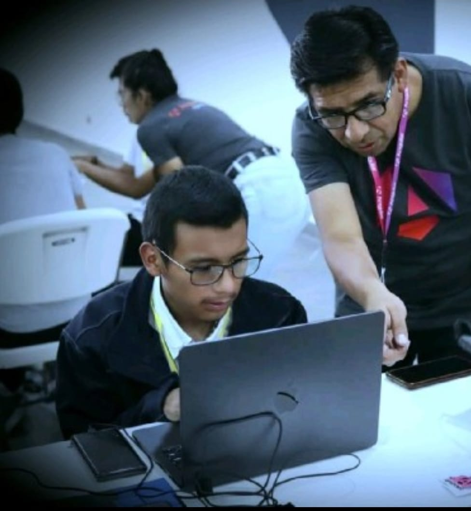

#  **Mi Biografía Personal**

## **Sobre mí**
Hola, soy *[Luis Enrique Ledezma Lopez]*, un apasionado por la tecnología, la programación tengo 19 años en unos meses cumplire 20 y bueno estudio 3 carreras actualmente ,y sii es reeeloco pero ahi vamos , estudio Ingenieria en Sitemas, Tec. Superior en Sistemas Informáticos e Ingenieria en Software mas que progrmar me interesa la ciberseguridad y me especializare  me gusta hacer deporte pero actualmente por el tiempo ya no puedo hacerlo, me gutas las galletas  el chocolate y el helado de crema me encanta lo que hago , y ando pensando en ser  Tik toker jiji 
##  **Mis hobbies favoritos**
1. Programar en diferentes lenguajes
2. Participar en hackatones y eventos tecnológicos
3. Leer sobre ciberseguridad
4. Jugar videojuegos estratégicos
5. Escuchar música urbana y motivacional

##  **Datos curiosos sobre mí**
- Amo trabajar de noche: me concentro mejor cuando todos duermen y no hay ruido.
- Me encanta tomar café!
- Mi primer “Hola Mundo” fue en JAVA.
- Siempre me apasiona aprender no me gusta quedarme con la duda sobre algo que me intriga.
- Prefiero las clases mas practicas que teóricas,para poder corregir mis errores.

##  **Frase que me motiva**
> *"En si es un canción la que me inspira a seguir ya que me recuerda casi todo lo que pase en mi vida y me identifico y es la de.."*  
> — *Paulo Londra, "Homerun"*

## 📸 **Mi primera vez programando en un evento de Angular Bolivia**

  
*Evento Angular Bolivia — un momento que marcó el inicio de mi camino como programador recuerdo que estaba en 0 en programación ya que recien había salido Promoción (Foto-MARZO 2024)*